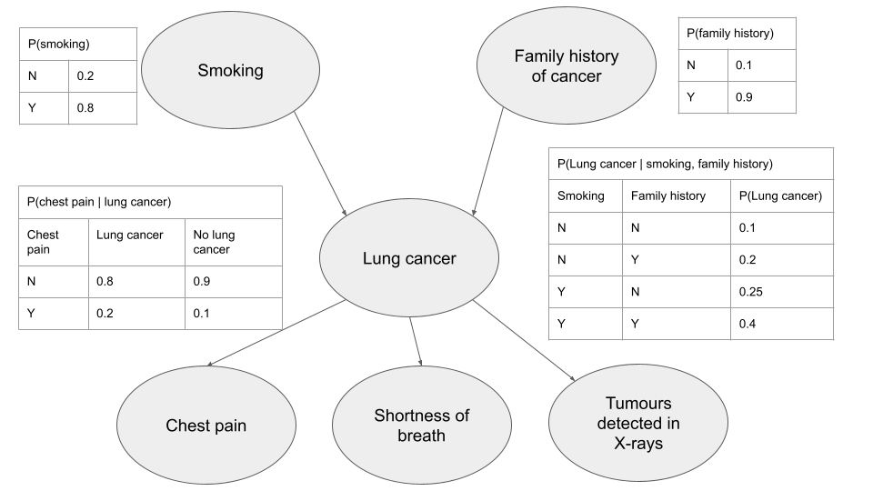

# Bayesian networks in public health

How can Bayesian networks be used in public health? One use case is to predict the risk that someone has a disease. This article explains Bayesian networks (BNs), and then illustrates how BNs can be used to predict coronary artery disease (CAD) risk.

Much of this article draws from [Arora, _et al_. (2019)](https://www.sciencedirect.com/science/article/pii/S1098301519300579) and [Gupta, _et al_. (2019)](https://pubmed.ncbi.nlm.nih.gov/31619130/). All errors are mine.

## About Bayesian Networks

A BN is a probabilistic graphical model; it contains a set of variables, as well as how variables depend on one another (e.g. how the probability of a variable taking on a certain value depends on the value of another variable). Suppose we have the following patient-level data: whether someone smoked, had a family history of cancer, had chest pain symptoms, had shortness of breath symptoms, had tumours show up in X-rays, and whether a patient actually had lung cancer. A Bayesian network can be built and trained to predict the probability that someone had lung cancer, based on the other information available. The diagram below shows one possible result. (Conditional probability tables for shortness of breath and tumours are not shown, but their structure is similar to the chest pain table)

In the above diagram, the BN is drawn as a directed acyclic graph (DAG). Let's break this term down:

* Graph: These are not typical "line graphs" we saw in grade school. Rather, a graph is a set of objects. Objects in the set may be related. In the above diagram, lung cancer and chest pain are both objects, and they are related.   
* Directed: Relationships between objects in the set have a direction. While lung cancer can cause chest pain, the reverse is unlikely to be true.
* Acyclic: There is no path from an object back to the object itself. The above graph is acyclic. However, if one were to draw a link from chest pain to smoking, it would no longer be acyclic.  

Notice that Bayesian networks have a qualitative and a quantitative component. The qualitative component consists of the network structure (links between objects). One can determine network structure through data-driven approaches (e.g. machine learning), expert/domain knowledge, or both. Domain knowledge is typically useful: to give a simple example, obesity does not influence age, so any model showing a link from obesity to age is suspect. The quantitative component tells us the strength of each link, and can be viewed as a factorization of the underlying joint probability distribution. In other words, the relationship between all variables in the model is broken down into simpler relationships (e.g. relationships between two variables).

## Advantages of Bayesian networks

Bayesian networks generate predictions that can be explained relatively easily, and allow for easily modelling of complex nonlinear relationships (such as "deep" causal structures). As such, BNs can be viewed as a "middle ground" between two common approaches to predicting disease risk: traditional regression models and machine learning approaches (in particular, neural networks). Neural networks can model arbitrarily complex relationships between variables. However, as neural networks themselves are complex, it's often difficult to explain why a neural network made a certain prediction. In contrast, traditional regression models are not as good at modelling complex relationships, but their predictions are more easily explained.

Also, as Bayesian networks are presented graphically, they can be critiqued easily even by people who don't have mathematical/statistical training.

Third, Bayesian networks allow for prior knowledge (e.g. results of previous studies, or expert knowledge) to be incorporated into the model, which can help in situations where there is little data but significant prior knowledge. (This follows from their very nature of being Bayesian).

Fourth, Bayesian networks can be transformed into decision models. One can then quantify the value of each piece of additional information (e.g. how would a medical test's results affect our predictions), and then obtain information with the highest value to cost ratio.

## Limitations of Bayesian networks

One cannot use a Bayesian network on observational data to determine whether a relationship is causal. (That said, this limitation also applies to other estimation methods)

Also, as Bayesian networks are less complex than many state-of-the-art machine learning methods, they may be less accurate.

## Example: Predicting coronary artery disease risk

[Gupta, _et al_. (2019)](https://pubmed.ncbi.nlm.nih.gov/31619130/) illustrate how a BN can be used to predict coronary artery disease (CAD) risk. They trained a BN on a data from 300 Iranian patients, which contained patient demographics, symptoms, ECG results, biomarkers, and CAD indicators.

They first discretized the data (by converting continuous variables into discrete ones), by using cutoff values where available (e.g. the abnormal/normal cutoff level), and binning the data when not. Discretizing the data allowed them to create a discrete BN; discrete BNs are more easily interpreted by non-experts, and impose weaker assumptions on the data.

They then estimated graph structure using a penalized maximum likelihood estimator. Roughly speaking, such an estimator tries to find the model with the greatest likelihood of producing the observed data (with an adjustment that typically favors simpler models over more complex ones). They used this estimator 10,000 times, each time using a bootstrapped dataset (a dataset obtained by sampling with replacement from the original dataset), and averaged all results. They also made sure that there were no links to age and sex from other variables. Parameters were then estimated using a Bayesian estimator with a Dirichlet prior.

They then trained some machine learning models (e.g. support vector machines, neural networks, and logistic regression) on the data, allowing them to see how BN fared relative to those models. BN's performance was on par with these models based on the AUC (area under the curve) accuracy metric: BN's AUC was 0.93, while the machine learning models had AUCs between 0.91 and 0.92. In this analysis, a model's AUC is the likelihood that a randomly selected patient with CAD would have a higher predicted probability of having CAD, compared to a randomly selected patient without CAD. Higher AUC scores are more desirable than lower AUC scores.

Thus, BNs have the potential to accurately predict disease probabilities in a way that can be easily understood.

<!--Scores were based on ten-fold cross-validation: the dataset was divided into ten subsets, and each time the model was trained on nine of the ten subsets, while accuracy was determined using the remaining subset ("test set"). The process was then repeated to allow each subset to be the test set.  -->
